# Análise da Arquitetura de Views e Lógica Dinâmica

## 1. Introdução

Este documento detalha a arquitetura de frontend do plugin `foton_contacts`, analisando a estrutura das views, a lógica de interatividade com JavaScript (Stimulus) e a forma como os componentes se inter-relacionam. O objetivo é estabelecer uma base de conhecimento clara para corrigir bugs e garantir a consistência em futuros desenvolvimentos.

## 2. Arquitetura e Padrões de Design

A arquitetura do plugin é moderna e segue de perto a filosofia "HTML-over-the-wire" popularizada pelo Hotwire.

-   **Backend:** O Rails é responsável por renderizar HTML. A lógica de negócio complexa é (ou deveria ser) isolada em Service Objects/Queries.
-   **Frontend:** A interatividade é controlada pela stack Hotwire (Turbo + Stimulus).

### Padrões de Turbo

1.  **Turbo Drive:** Gerencia a navegação principal, proporcionando uma experiência de SPA.
2.  **Turbo Frames (`turbo_frame_tag`):** É o pilar da arquitetura de componentização e interatividade. Seu uso no plugin se divide em dois padrões principais:
    *   **Lazy Loading (Carregamento Sob Demanda):** Um frame é renderizado com um atributo `src`. O Turbo automaticamente faz uma requisição a essa URL e substitui o conteúdo do frame pela resposta. **Padrão Crucial:** A resposta do servidor para uma requisição de frame **deve conter um `turbo_frame_tag` com o mesmo ID**. Se não contiver, o Turbo ignora a resposta.
    *   **Targeted Updates (Atualizações Direcionadas):** Links e formulários podem especificar um `data-turbo-frame="..."` para direcionar sua resposta a um frame específico na página. O exemplo mais claro é o uso de um `<turbo_frame_tag id="modal">` para renderizar todos os modais da aplicação.

3.  **Turbo Streams (`turbo_stream`):** Usado para atualizações reativas no DOM em resposta a ações de `create`, `update` e `destroy`. Permite adicionar, remover ou substituir múltiplos elementos na página com uma única resposta do servidor.

### Padrões de Stimulus

1.  **Carregamento Não Convencional:** Este é um **ponto crítico de incongruência**. Os controllers Stimulus existentes (`show_tabs_controller.js`, `modal_controller.js`, etc.) **não usam `import/export`**. Eles se anexam ao objeto `window` e são registrados em `application.js` através de um IIFE (Immediately Invoked Function Expression) com um `setInterval`. Qualquer novo controller JS que não siga este padrão **não será carregado**.
2.  **Controllers Focados:** Cada controller tem uma única responsabilidade (ex: `inline-edit-controller` para edição no local, `nested-form-controller` para formulários aninhados).

## 3. Análise Detalhada das Views

| Arquivo da View (Exemplos) | Propósito Principal | Relações (Partials, Frames) | Lógica Dinâmica (Controller Stimulus) |
| :--- | :--- | :--- | :--- |
| `contacts/index.html.erb` | Página principal, lista todos os contatos. | Renderiza `_contact_row.html.erb` para cada contato. Contém `<turbo_frame_tag "modal">` e `<turbo_frame_tag "dynamic_dashboard">`. | Usa `contact-filter-observer` para atualizar o dashboard dinâmico. |
| `contacts/show.html.erb` | Página de detalhes de um contato. | Define uma estrutura de abas. Cada aba renderiza uma partial `_..._frame.html.erb`. | Usa `show-tabs-controller` para gerenciar a troca de abas. |
| `contacts/show_tabs/*_frame.html.erb` | Contêiner de Turbo Frame para lazy-loading. | Contém um único `<turbo_frame_tag ... src="...">` que carrega o conteúdo real. | Nenhuma. |
| `contacts/show_tabs/*_content.html.erb` | Conteúdo real de uma aba. | É envolvido por um `turbo_frame_tag` com o mesmo ID do seu "frame" pai. | Nenhuma. |
| `contacts/_form.html.erb` | Formulário de criação/edição de contato. | Renderizado dentro de um modal. | Usa `nested-form` para campos de vínculo empregatício. |
| `contacts/_analytics_modal.html.erb` | Modal de análise de um contato. | Renderizado dentro de `<turbo_frame_tag "modal">`. | Usa `analytics-tabs-controller` para suas abas internas. |
| `analytics/index.html.erb` | Página principal do dashboard de BI. | Define a estrutura de abas e os `turbo_frame_tag`s para os widgets. | Usa `analytics-tabs-controller`. |
| `analytics/widgets/_irpa_widget.html.erb` | Partial para um widget específico. | **DEVERIA** ser envolvida por um `<turbo_frame_tag "irpa_widget">`. | Nenhuma. |
| `analytics/analytics/index.html.erb` | Página principal do dashboard de BI. | Define a estrutura de abas e os `turbo_frame_tag`s para os widgets. | Usa `analytics-tabs-controller`. |
| `analytics/analytics/widgets/_irpa_widget.html.erb` | Exibe a tabela de riscos (IRPA). | Envolvida por `<turbo_frame_tag "irpa_widget">`. Renderiza links para o modal de detalhes. | Nenhuma. |
| `analytics/analytics/widgets/_team_performance.html.erb` | Exibe o gráfico de radar e ranking de equipes. | Envolvida por `<turbo_frame_tag "team_performance_widget">`. | Usa o helper `radar_chart` (Chartkick). |
| `analytics/analytics/widgets/_workload.html.erb` | Exibe o mapa de calor da carga de trabalho. | Envolvida por `<turbo_frame_tag "workload_widget">`. | Nenhuma. |
| `analytics/analytics/widgets/_details_modal.html.erb` | Conteúdo do modal de análise de risco individual. | Envolvida por `<turbo_frame_tag "modal">`. | Nenhuma. |
| `analytics/analytics/widgets/_dynamic_dashboard.html.erb`| Dashboard que reage aos filtros da lista de contatos. | Envolvida por `<turbo_frame_tag "dynamic_dashboard">`. | Nenhuma. |

## 4. Análise dos Assets (JavaScript & CSS)

-   **CSS:**
    -   `contacts.css`: Estilos gerais do plugin.
    -   `tom-select.bootstrap5.css`: Estilos para a biblioteca Tom Select.
-   **JavaScript (`assets/javascripts/`):**
    -   `application.js`: **Ponto de entrada principal**. Usa `//= require` para incluir todos os controllers e depois os registra no Stimulus a partir do objeto `window`. **Qualquer novo controller JS precisa ser adicionado aqui.**
    -   `controllers/`: Contém os controllers Stimulus.
        -   `modal_controller.js`: Gerencia a abertura/fechamento de modais e o histórico do navegador.
        -   `show_tabs_controller.js`: Gerencia a troca de abas na página de detalhes do contato.
        -   `inline_edit_controller.js`: Controla a edição "inline" de campos (ex: "Função" na issue).
        -   `analytics_tabs_controller.js`: **(Com Bug)** Controla as abas da página de Analytics. Foi corrigido para usar o padrão IIFE.
        -   `contact_filter_observer_controller.js`: **(Com Bug)** Controla a atualização do dashboard dinâmico. **Não segue o padrão IIFE.**
        -   `workload_alert_controller.js`: **(Com Bug)** Controla o alerta de sobrecarga. **Não segue o padrão IIFE.**

## 5. Diagrama de Relações (Lazy Loading)

O fluxograma abaixo ilustra o padrão de lazy-loading que funciona no `contacts#show` e que **deveria** funcionar no `analytics#index`.

```mermaid
graph TD
    subgraph "Fluxo Correto (contacts#show)"
        A[Request: /contacts/1] --> B[contacts#show];
        B --> C[Renderiza show.html.erb];
        C --> D["Renderiza _career_history_frame.html.erb"];
        D --> E["Frame: <turbo_frame id='frame_id' src='/path'>"];
        E -- Requisição Turbo --> F[Controller Action];
        F --> G["Renderiza _career_history.html.erb"];
        G --> H["Resposta: <turbo_frame id='frame_id'>Conteúdo</turbo_frame>"];
        H --> I[Conteúdo aparece na tela];
    end

    subgraph "Fluxo Quebrado (analytics#index)"
        J[Request: /analytics] --> K[analytics#index];
        K --> L[Renderiza analytics/index.html.erb];
        L --> M["Renderiza <turbo_frame id='widget_id' src='/path'>"];
        M -- Requisição Turbo --> N[Widget Action];
        N --> O["Renderiza _irpa_widget.html.erb"];
        O --> P["Resposta: <div>...Conteúdo...</div> (sem frame!)"];
        P -- ERRO --> Q[Turbo ignora a resposta. Conteúdo fica vazio.];
    end
```

## 6. Diagnóstico de Incongruências e Bugs

1.  **Incongruência de Padrão JS (Causa Raiz):** Os controllers `contact_filter_observer_controller.js` e `workload_alert_controller.js` foram criados com `import/export`, mas o `application.js` espera que eles existam no objeto `window` e não os registra. **Isso quebra a funcionalidade do dashboard dinâmico e do alerta de sobrecarga.**
2.  **Incongruência de Renderização de Turbo Frame (Causa Raiz):** As actions dos widgets no `AnalyticsController` (`irpa_widget`, `team_performance`, etc.) renderizam uma `partial`. No entanto, os arquivos dessas parciais **não estão envolvidos por um `turbo_frame_tag` com o ID correspondente**. Conforme o diagrama acima, isso faz com que o Turbo descarte a resposta, e o conteúdo dos widgets nunca aparece.
3.  **Bugs nos Modais de Análise:** O mau funcionamento do modal de análise (`_analytics_modal.html.erb`) é um sintoma direto do bug de carregamento do `analytics_tabs_controller.js`. Como as abas internas do modal não funcionam, ele parece quebrado.

## 7. Plano de Correção Definitivo

Para alinhar toda a nova implementação com a arquitetura existente e corrigir os bugs de forma definitiva, executarei os seguintes passos:

1.  **Refatorar todos os novos controllers Stimulus** (`contact_filter_observer_controller.js` e `workload_alert_controller.js`) para usar o padrão IIFE + `window.ControllerName`, garantindo que sejam corretamente registrados pelo `application.js`.
2.  **Envolver todas as views parciais de widgets** (`_irpa_widget.html.erb`, `_team_performance.html.erb`, etc.) com o `turbo_frame_tag` correspondente ao seu ID.
3.  **Verificar e garantir** que o `application.js` está incluindo (`//= require`) todos os arquivos de controller JS necessários.

---
