# Relatório Técnico: Arquitetura de Views do Foton Contacts

## 1. Visão Geral

Este documento é a fonte da verdade para a arquitetura, conceitos e diretrizes de frontend (UI/UX) do plugin **Foton Contacts**. Ele descreve a estrutura implementada e estabelece os princípios para a evolução da interface.

Para o plano de trabalho e tarefas pendentes, consulte o **[Workplan](workplan.md)**.
Para o manual de funcionalidades e histórico de desenvolvimento, consulte o **[Roadmap](ROADMAP.md)**.

---

## 2. Filosofia e Diretrizes de Design

O desenvolvimento do plugin é guiado por uma filosofia de design clara e consistente.

### 2.1. Princípios Fundamentais

1.  **Integração Nativa e Fluidez:** O plugin se comporta como uma extensão natural do Redmine.
2.  **Foco Absoluto em Usabilidade (UI/UX):** A usabilidade é a prioridade máxima.
3.  **Inteligência de Dados e Ação:** O plugin transforma dados brutos em insights acionáveis.
4.  **Desempenho:** O plugin é otimizado para um bom desempenho com carregamento sob demanda.
5.  **Segurança e Resiliência:** A arquitetura é robusta e valida todas as entradas de dados.
6.  **Qualidade de Código:** O projeto segue o padrão *Conventional Commits*.

---

## 3. Arquitetura e Stack Tecnológica

A arquitetura de frontend do plugin é baseada no framework **Hotwire (Turbo + Stimulus)**.

- **Turbo Drive & Frames:** A navegação é acelerada e a página é componentizada em `Turbo Frames`. Isso permite que partes da interface sejam carregadas e atualizadas de forma independente.
    - **Lazy Loading:** Um frame com um atributo `src` carrega seu conteúdo de forma assíncrona.
    - **Targeted Updates:** Formulários e links podem mirar em um frame específico usando `data-turbo-frame`.
- **Turbo Streams:** As atualizações reativas (CRUD) são realizadas via `Turbo Streams`.
- **Stimulus:** É utilizado para interações leves no lado do cliente que complementam o Hotwire, como controle de abas e wrappers de bibliotecas.

---

## 4. Padrão de Filtros com Turbo Frames

Para implementar filtros que atualizam uma parte da página (ex: uma tabela de resultados), o padrão validado é o **"Target Direto"**. Esta abordagem é simples, declarativa e não requer JavaScript customizado.

1.  **Estrutura:** A view contém um formulário de filtro e um `turbo_frame_tag` separado para os resultados.
2.  **Formulário:** O `form_tag` aponta para a action que busca os dados e **deve** conter o atributo `data: { "turbo-frame": "ID_DO_FRAME_DE_RESULTADOS" }`.
3.  **Resposta:** A action do controller renderiza uma partial. Essa partial de resposta **deve** ser envolvida por um `turbo_frame_tag` com o **mesmo ID** do frame de resultados.

Este ciclo de "mira" e "resposta com o mesmo ID" é a regra fundamental para o funcionamento correto das atualizações de frame.

```mermaid
graph TD
    subgraph "Fluxo de Filtro com Target Direto"
        A[Usuário submete formulário<br/>`form data-turbo-frame="results_frame"`] --> B{Requisição GET para<br/>`.../results_path?params`};
        B --> C[Controller#results_action];
        C --> D[Renderiza a partial `_results.html.erb`];
        D --> E[Resposta HTML: `<turbo_frame id="results_frame">...tabela...</turbo_frame>`];
        E -- Turbo Encontra o ID Correspondente --> F[Conteúdo do frame `results_frame` na página é atualizado];
    end
```

---

## 5. Padrão de Arquitetura para Modais

Para garantir consistência e robustez, todos os modais do plugin (seja para CRUD, análise ou qualquer outra finalidade) devem seguir um fluxo de 4 passos baseado em Turbo Frames e Turbo Streams. Este padrão centraliza a lógica no servidor e proporciona uma experiência de usuário fluida.

1.  **Passo 1: O Receptáculo (A View Principal)**
    -   Qualquer página que precise abrir um modal **deve** conter um `turbo_frame_tag` global, vazio e com `id="modal"`.
    -   Este frame funciona como um "receptáculo" que será preenchido com o conteúdo do modal.
    -   **Exemplo (`app/views/analytics/index.html.erb`):**
        ```erb
        <%# ... conteúdo da página ... %>
        <%= turbo_frame_tag "modal", data: { controller: "modal" } %>
        ```

2.  **Passo 2: O Gatilho (O Link de Abertura)**
    -   O link que aciona o modal (ex: "Editar Contato", "Ver Análise") **deve** apontar para a rota do controller que gera o conteúdo do modal.
    -   Ele **deve** incluir o atributo `data: { turbo_frame: "modal" }` para instruir o Turbo a carregar a resposta dentro do receptáculo do Passo 1.
    -   **Exemplo (`_irpa_table.html.erb`):**
        ```erb
        <%= link_to "Ver Análise", analytics_contact_details_path(id: contact.id), data: { turbo_frame: "modal" } %>
        ```

3.  **Passo 3: O Conteúdo (A Action e a Partial do Modal)**
    -   A `action` do controller (ex: `analytics#contact_details`) busca os dados necessários.
    -   Ela renderiza uma `partial` que contém o HTML do modal.
    -   **Regra de Ouro:** O conteúdo desta partial **deve** ser envolvido por um `turbo_frame_tag` com o **mesmo ID "modal"**.
    -   **Exemplo (`_details_modal.html.erb`):**
        ```erb
        <%= turbo_frame_tag "modal" do %>
          <div class="modal-content">
            <%# ... cabeçalho, corpo e conteúdo do modal ... %>
          </div>
        <% end %>
        ```

4.  **Passo 4: O Fechamento (Padrão de Reset Resiliente)**
    -   O botão ou link de fechar dentro do modal **deve** ser um `link_to` que aponta para uma rota dedicada e genérica, como `close_modal_contacts_path`.
    -   Este link **deve** usar o método `POST` via `data: { turbo_method: :post }`.
    -   A `action` do controller para esta rota (ex: `ContactsController#close_modal`) **deve** responder com **duas** `turbo_stream` actions para garantir um reset completo e resiliente do estado do modal.
        1.  **`turbo_stream.remove("modal")`**: Remove o frame atual do DOM. Isso aciona o método `disconnect()` do controller Stimulus (`modal_controller.js`), que é responsável por limpar classes do `<body>` (ex: `modal-open`) e esconder a "casca" do modal.
        2.  **`turbo_stream.append("content", ...)`**: Imediatamente após, anexa um novo `turbo_frame_tag("modal")` vazio de volta à página. Isso garante que o "receptáculo" esteja sempre presente para a próxima vez que o usuário quiser abrir um modal.
    -   **Exemplo de Link (`_analytics_modal.html.erb`):**
        ```erb
        <%= link_to l(:button_close), close_modal_contacts_path, class: "btn btn-secondary", data: { "turbo-method": :post } %>
        ```
    -   **Exemplo de Action (`contacts_controller.rb`):**
        ```ruby
        def close_modal
          respond_to do |format|
            format.turbo_stream do
              render turbo_stream: [
                turbo_stream.remove("modal"),
                turbo_stream.append("content", "<turbo-frame id='modal' data-controller='modal'></turbo-frame>")
              ]
            end
            format.html { redirect_to contacts_path }
          end
        end
        ```

Este fluxo de "remover e recriar" é a abordagem mais robusta, pois garante que o modal seja completamente desmontado e que a página retorne ao seu estado original, pronta para uma nova interação, eliminando bugs de "modal preso" ou falhas em aberturas subsequentes.

```mermaid
graph TD
    subgraph "Ciclo de Vida do Modal (Padrão Resiliente)"
        A[Página com <turbo_frame id='modal'>] --> B(Usuário clica em <br/> `link_to ... data-turbo-frame='modal'`);
        B --> C{Req GET para<br/>`contacts#show`};
        C --> D[Controller renderiza<br/>`show.html.erb`];
        D --> E[Resposta: `<turbo_frame id='modal'>...conteúdo...</turbo_frame>`];
        E --> F[Modal aparece na tela];
        F --> G(Usuário clica em <br/>`link_to close_modal_path, method: :post`);
        G --> H{Req POST para<br/>`contacts#close_modal`};
        H --> I[Controller renderiza<br/>`turbo_stream.remove("modal")` e<br/>`turbo_stream.append(...)`];
        I --> J[Modal desaparece e um novo<br/>receptáculo <turbo_frame id='modal'> é criado];
    end
```

---

## 6. Arquitetura do Dashboard de BI (Monolito-Modular)

O Dashboard de BI utiliza uma arquitetura de três estágios para componentização e lazy-loading.

- **Estágio 1: Frame da Aba (`tabs/_*_frame.html.erb`):** Renderiza um `turbo_frame_tag` com `src` que aponta para a action de layout da aba.
- **Estágio 2: Layout da Aba (`tabs/_*.html.erb`):** É a resposta da action. Define a estrutura de grid e renderiza os componentes, passando os dados. **Deve ser envolvida por um `turbo_frame_tag` com o mesmo ID do Estágio 1.**
- **Estágio 3: Componentes (`components/_*.html.erb`):** Partials focadas que renderizam um único elemento de UI (tabela, gráfico) e recebem dados via `locals`.

O fluxograma para a aba "Visão Geral" ilustra este padrão:

```mermaid
graph TD
    subgraph "Fluxo de Renderização - Monolito-Modular"
        A[Request: /analytics?tab=overview] --> B[AnalyticsController#index];
        B --> C[Renderiza a view principal `analytics/index.html.erb`];
        C --> D[Renderiza a partial de frame `tabs/_overview_frame.html.erb`];
        D -- Turbo dispara requisição para o `src` do frame --> E[Request: /analytics/overview_tab];
        E --> F[AnalyticsController#overview_tab];
        F -- Busca dados e renderiza o layout da aba --> G[Resposta: `<turbo_frame id="overview_tab_content">...layout com componentes...</turbo_frame>`];
        G --> H[HTML da resposta é inserido no frame `overview_tab_content`];
    end
```



---

## 7. Diagnóstico de Erros Comuns (Lições Aprendidas)

1.  **`Content Missing` ou `did not contain the expected <turbo-frame ...>`:** Este é o erro mais comum. A causa é sempre a mesma: um `turbo_frame_tag` fez uma requisição, mas o HTML da resposta do servidor **não continha** um `turbo_frame_tag` com o **mesmo ID**. A solução é sempre garantir essa correspondência entre a requisição e a resposta.

2.  **Gráficos Não Renderizam ou Renderizam o Tipo Errado:**
    - **Causa A (Conflito de Gems):** A presença simultânea de `chartkick` e `chartjs-ror` causa conflitos nos helpers do Rails. A solução é remover `chartjs-ror`.
    - **Causa B (Falha no Asset Pipeline):** O `application.js` do plugin não se mostrou confiável para empacotar o JS de gems externas. A solução é carregar `Chart.js` e `Chartkick.js` via CDN na view principal.
    - **Causa C (Falha nos Helpers):** Os helpers do Rails (`line_chart`, etc.) podem não gerar o JavaScript correto para opções complexas (como gráficos de radar). A solução validada é chamar a biblioteca `Chartkick.js` diretamente via uma tag `<script>` na view.

3.  **Filtro Recarrega a Página Inteira:** Acontece quando um formulário é submetido sem o atributo `data-turbo-frame`. O Turbo o trata como uma navegação normal. A solução é usar o padrão de **Target Direto** descrito na seção 4.

---

## 8. Arquitetura de Estilização e Layout (CSS)

Para garantir consistência, manutenibilidade e desempenho, o plugin adota uma **arquitetura de estilização híbrida**.

### 8.1. Tecnologias e Filosofia

1.  **Bootstrap 5 (Framework Base):**
    -   **Motivo:** Fornece uma base sólida e familiar de componentes (cards, botões, modais, formulários), um sistema de espaçamento e uma base tipográfica consistente. Acelera o desenvolvimento e reduz a necessidade de CSS customizado, alinhando-se aos princípios de **baixa curva de aprendizado e manutenção rápida**.
    -   **Aplicação:** Deve ser usado para o scaffolding geral da página (estrutura de containers, layout principal) e para a estilização de componentes de UI padrão.
    -   **Diretriz de Autohospedagem:** Para garantir o funcionamento em ambientes offline, o Bootstrap **deve** ser incluído no *asset pipeline* do plugin. Seus arquivos (`.css` e `.js`) devem ser armazenados localmente no diretório `assets/` e carregados via `application.css` e `application.js`. O uso de CDNs para o Bootstrap deve ser evitado em produção.

2.  **CSS Grid (Layouts Complexos):**
    -   **Motivo:** É a tecnologia nativa do navegador para a criação de layouts de duas dimensões. É a ferramenta ideal para organizar os múltiplos *widgets* e *cards* de um dashboard, como o de BI. A sintaxe é declarativa, poderosa e mais limpa do que aninhar múltiplas `div.row` e `div.col-*` do Bootstrap para o mesmo fim. Por ser nativo, **não possui dependências**, o que reforça a filosofia de autohospedagem.
    -   **Aplicação:** Deve ser usado para orquestrar a posição dos `turbo-frame`s que compõem um dashboard ou uma grade complexa de componentes.

### 8.2. Como Utilizar (Diretrizes Práticas)

A regra geral é: **Bootstrap para a aparência dos "tijolos", CSS Grid para a planta baixa de como os "tijolos" são organizados.**

-   **Use Bootstrap para:**
    -   Estrutura básica da página: `container`, `row`.
    -   Componentes: `card`, `btn`, `modal`, `form-control`.
    -   Layouts lineares simples: `<div class="row"><div class="col-md-6">...</div><div class="col-md-6">...</div></div>`.

-   **Use CSS Grid para:**
    -   Layouts de dashboard com múltiplos cards em proporções não-lineares (ex: uma coluna de 2/3 ao lado de uma de 1/3).
    -   **Exemplo Prático (Dashboard de BI):**
        ```html
        <%# 1. O contêiner com a classe de grid %>
        <div class="analytics-grid-container two-column-layout">

          <%# 2. Os itens do grid (nossos Turbo Frames) %>
          <%= turbo_frame_tag "main_widget" do %>
            <div class="card">...</div>
          <% end %>
          <%= turbo_frame_tag "sidebar_widget" do %>
            <div class="card">...</div>
          <% end %>
        </div>
        ```
        ```css
        /* 3. A definição do grid em contacts.css */
        .analytics-grid-container.two-column-layout {
          display: grid;
          grid-template-columns: 2fr 1fr; /* Proporção 2/3 e 1/3 */
          gap: 20px;
        }
        ```

-   **O que NÃO fazer (Antipadrão):**
    -   **Nunca** aplique `display: grid` diretamente a uma classe de coluna do Bootstrap (`.col-md-8`, `.col-4`, etc.). Isso gera conflitos com o sistema de Flexbox do Bootstrap e cria um comportamento imprevisível. Sempre crie um `div` contêiner separado para o seu grid.
