# Relatório Técnico: Arquitetura de Views do Foton Contacts

## 1. Visão Geral

Este documento é a fonte da verdade para a arquitetura, conceitos e diretrizes de frontend (UI/UX) do plugin **Foton Contacts**. Ele descreve a estrutura implementada e estabelece os princípios para a evolução da interface.

Para o plano de trabalho e tarefas pendentes, consulte o **[Workplan](workplan.md)**.
Para o manual de funcionalidades e histórico de desenvolvimento, consulte o **[Roadmap](ROADMAP.md)**.

---

## 2. Filosofia e Diretrizes de Design

O desenvolvimento do plugin é guiado por uma filosofia de design clara e consistente.

### 2.1. Princípios Fundamentais

1.  **Integração Nativa e Fluidez:** O plugin se comporta como uma extensão natural do Redmine.
2.  **Foco Absoluto em Usabilidade (UI/UX):** A usabilidade é a prioridade máxima.
3.  **Inteligência de Dados e Ação:** O plugin transforma dados brutos em insights acionáveis.
4.  **Desempenho:** O plugin é otimizado para um bom desempenho com carregamento sob demanda.
5.  **Segurança e Resiliência:** A arquitetura é robusta e valida todas as entradas de dados.
6.  **Qualidade de Código:** O projeto segue o padrão *Conventional Commits*.

---

## 3. Arquitetura e Stack Tecnológica

A arquitetura de frontend do plugin é baseada no framework **Hotwire (Turbo + Stimulus)**.

- **Turbo Drive & Frames:** A navegação é acelerada e a página é componentizada em `Turbo Frames`. Isso permite que partes da interface sejam carregadas e atualizadas de forma independente.
    - **Lazy Loading:** Um frame com um atributo `src` carrega seu conteúdo de forma assíncrona.
    - **Targeted Updates:** Formulários e links podem mirar em um frame específico usando `data-turbo-frame`.
- **Turbo Streams:** As atualizações reativas (CRUD) são realizadas via `Turbo Streams`.
- **Stimulus:** É utilizado para interações leves no lado do cliente que complementam o Hotwire, como controle de abas e wrappers de bibliotecas.

---

## 4. Padrão de Filtros com Turbo Frames

Para implementar filtros que atualizam uma parte da página (ex: uma tabela de resultados), o padrão validado é o **"Target Direto"**. Esta abordagem é simples, declarativa e não requer JavaScript customizado.

1.  **Estrutura:** A view contém um formulário de filtro e um `turbo_frame_tag` separado para os resultados.
2.  **Formulário:** O `form_tag` aponta para a action que busca os dados e **deve** conter o atributo `data: { "turbo-frame": "ID_DO_FRAME_DE_RESULTADOS" }`.
3.  **Resposta:** A action do controller renderiza uma partial. Essa partial de resposta **deve** ser envolvida por um `turbo_frame_tag` com o **mesmo ID** do frame de resultados.

Este ciclo de "mira" e "resposta com o mesmo ID" é a regra fundamental para o funcionamento correto das atualizações de frame.

```mermaid
graph TD
    subgraph "Fluxo de Filtro com Target Direto"
        A[Usuário submete formulário<br/>`form data-turbo-frame="results_frame"`] --> B{Requisição GET para<br/>`.../results_path?params`};
        B --> C[Controller#results_action];
        C --> D[Renderiza a partial `_results.html.erb`];
        D --> E[Resposta HTML: `<turbo_frame id="results_frame">...tabela...</turbo_frame>`];
        E -- Turbo Encontra o ID Correspondente --> F[Conteúdo do frame `results_frame` na página é atualizado];
    end
```

---

## 5. Arquitetura do Dashboard de BI (Monolito-Modular)

O Dashboard de BI utiliza uma arquitetura de três estágios para componentização e lazy-loading.

- **Estágio 1: Frame da Aba (`tabs/_*_frame.html.erb`):** Renderiza um `turbo_frame_tag` com `src` que aponta para a action de layout da aba.
- **Estágio 2: Layout da Aba (`tabs/_*.html.erb`):** É a resposta da action. Define a estrutura de grid e renderiza os componentes, passando os dados. **Deve ser envolvida por um `turbo_frame_tag` com o mesmo ID do Estágio 1.**
- **Estágio 3: Componentes (`components/_*.html.erb`):** Partials focadas que renderizam um único elemento de UI (tabela, gráfico) e recebem dados via `locals`.

O fluxograma para a aba "Visão Geral" ilustra este padrão:

```mermaid
graph TD
    subgraph "Fluxo de Renderização - Monolito-Modular"
        A[Request: /analytics?tab=overview] --> B[AnalyticsController#index];
        B --> C[Renderiza a view principal `analytics/index.html.erb`];
        C --> D[Renderiza a partial de frame `tabs/_overview_frame.html.erb`];
        D -- Turbo dispara requisição para o `src` do frame --> E[Request: /analytics/overview_tab];
        E --> F[AnalyticsController#overview_tab];
        F -- Busca dados e renderiza o layout da aba --> G[Resposta: `<turbo_frame id="overview_tab_content">...layout com componentes...</turbo_frame>`];
        G --> H[HTML da resposta é inserido no frame `overview_tab_content`];
    end
```



---

## 6. Diagnóstico de Erros Comuns (Lições Aprendidas)

1.  **`Content Missing` ou `did not contain the expected <turbo-frame ...>`:** Este é o erro mais comum. A causa é sempre a mesma: um `turbo_frame_tag` fez uma requisição, mas o HTML da resposta do servidor **não continha** um `turbo_frame_tag` com o **mesmo ID**. A solução é sempre garantir essa correspondência entre a requisição e a resposta.

2.  **Gráficos Não Renderizam ou Renderizam o Tipo Errado:**
    - **Causa A (Conflito de Gems):** A presença simultânea de `chartkick` e `chartjs-ror` causa conflitos nos helpers do Rails. A solução é remover `chartjs-ror`.
    - **Causa B (Falha no Asset Pipeline):** O `application.js` do plugin não se mostrou confiável para empacotar o JS de gems externas. A solução é carregar `Chart.js` e `Chartkick.js` via CDN na view principal.
    - **Causa C (Falha nos Helpers):** Os helpers do Rails (`line_chart`, etc.) podem não gerar o JavaScript correto para opções complexas (como gráficos de radar). A solução validada é chamar a biblioteca `Chartkick.js` diretamente via uma tag `<script>` na view.

3.  **Filtro Recarrega a Página Inteira:** Acontece quando um formulário é submetido sem o atributo `data-turbo-frame`. O Turbo o trata como uma navegação normal. A solução é usar o padrão de **Target Direto** descrito na seção 4.
